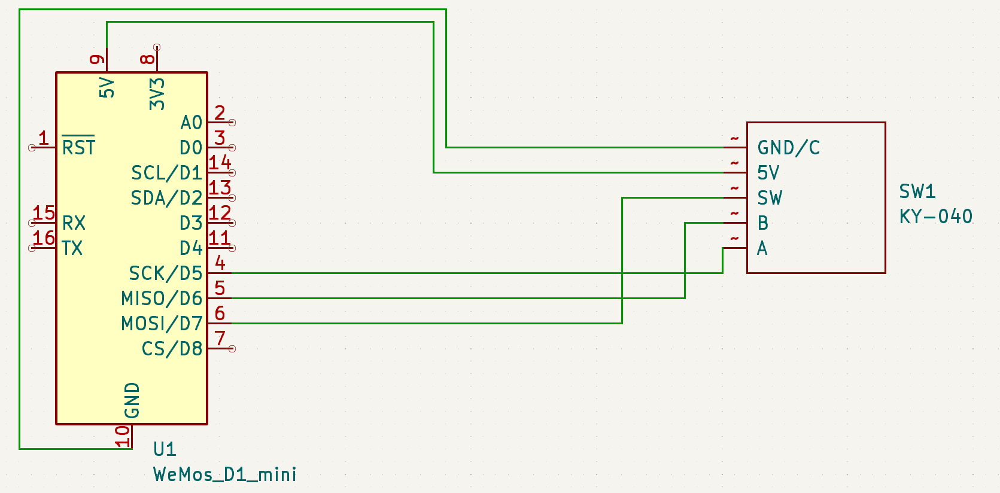

> WARINING! WORK IN PROGRESS Project, so this documentation is not fully complete at the moment.
> 

# Description
Inspired by Timebuzzer, I wanted a similiar function the will help me to track my worktime at my customer porjects. 
Instead of having large excels and complicated mobile apps (that I must unlock and start), I wanted a simple button to track the time. 

Yes there are several other ways to to this, but in my case it will be a nice small thing that I will use for my personal workflow. 


# :nut_and_bolt: Hardware
## Parts
For building this Device you will need some hardware parts, not may but a few are required: 

### Rotary encoder
First of all you need a rotary encoder like this https://amzn.to/3KplRgn. This will give you the support to perfom clicks / approves (Button press) and swlwcting (by rotate the knob). 

### Wemos d1 mini
The next part you need is an Wemos D1 mini like this https://amzn.to/3Kl0GfK. This will get your Firmware and act as our "brain" of the hardware :). 


##  Wiring
Wire both parts together like this: 



# :package: The case
The Case was quite simple, I wanted a small round circled case fir this, so in this must fit the wemos and there will be also the roatry encoder souted through a hole on the top to ensure the button functionality

I devided the party in to two gcode files 

[The round Case with hole for the rotary encoder](Case.gcode)


[The bottom ground](Bottom.gcode)

You can print and assemble this at your own.

# :rocket: Software
Ths software is divided in two parts. The client app (`ClienApplication`) and the hardware part (`DeviceApplication`).

# How to Compile
Before you can use the application itself, you must identify your serial port that will be used to comunicate. For this you firest compile and upload the client application. While you upload it, you will notice the upload COM-Port. This port you must later set into the connection properties.

## DeviceApplication
Just open Visual studio code (with Platform io installed) and just run the following command in the platform io cli 

```bash
pio run --target upload
```

If you are fan from makefiles you can use 

```bash
make upload-firmware
```
to upload the firmware to your device. 


## ClientApplication 
Just open up your Visual Studio and hit F5. 


## Communication with each other


